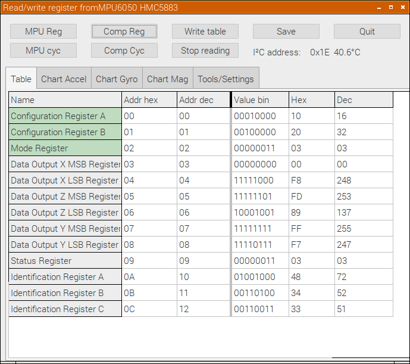

# MPU6050-test-tool

A small tool to test and learn something about MPU6050 registers with GUI for Raspberry Pi.
With latest version more sensors are supported:
- MPU6050 (Gyro & accelerometer)
- IST8310 (Magnetometer)
- HMC5883 (Magnetometer)
- AS5600 (Contactless potentiometer
- PFC8591 (4-channel ADC & 1-channel DAC)

This programm uses latest unit "mpu_ctrl.pas" from repository "common_units"
